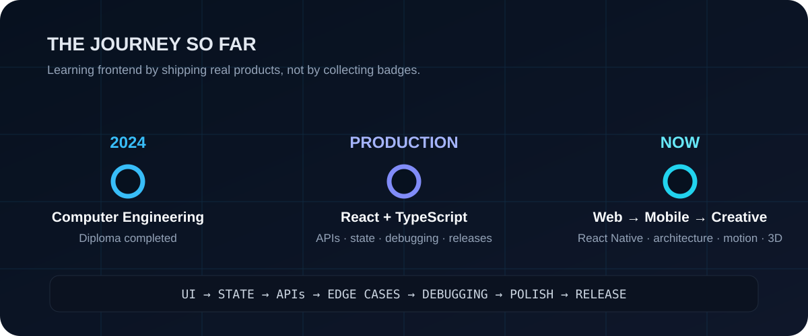
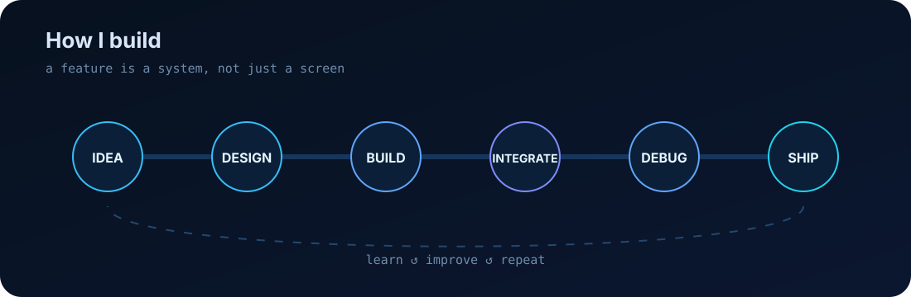
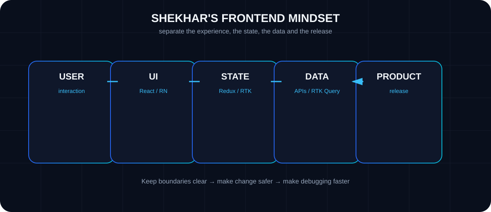
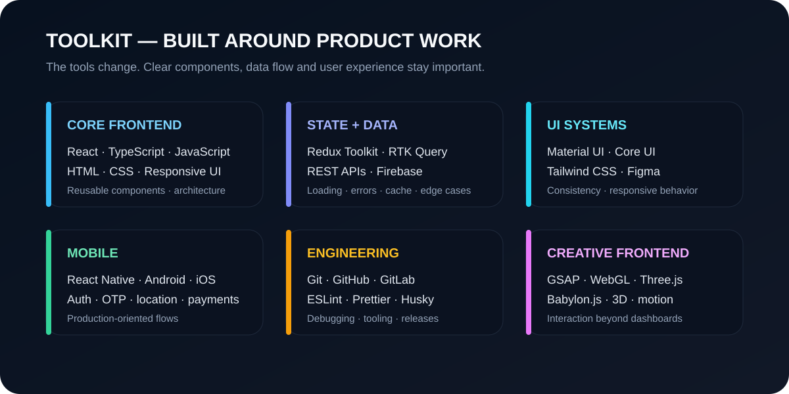
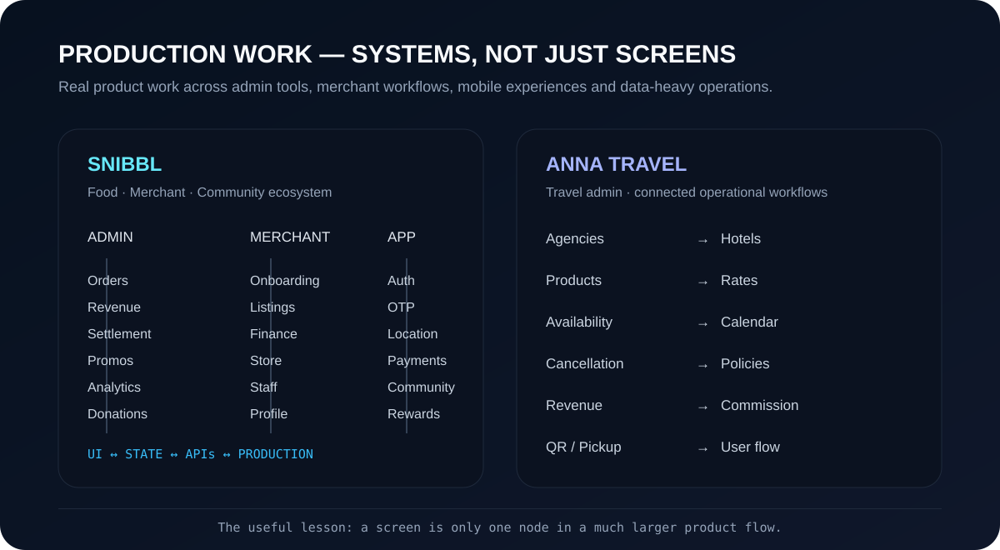
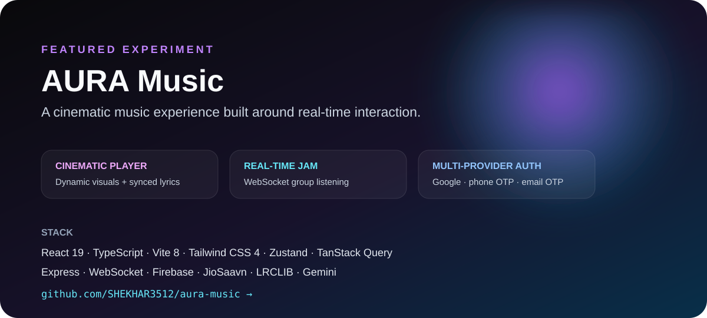
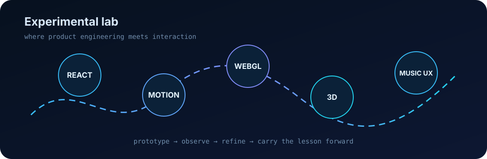
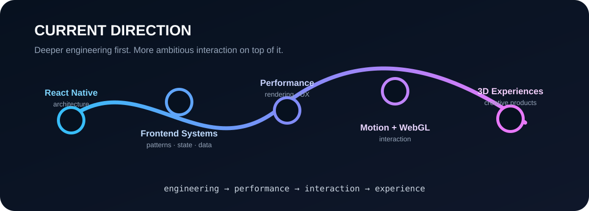

<div align="center">



### Frontend Developer · React · React Native · TypeScript · Creative UI

**[GitHub](https://github.com/SHEKHAR3512)** · **[LinkedIn](https://www.linkedin.com/in/shekhar-birda-279763353/)** · **[Portfolio](https://shekhar-birda--3d-interactive-portf.vercel.app/)** · **[Email](mailto:shekharjaat751@gmail.com)**

> I turn product ideas into interfaces that survive real APIs, edge cases, debugging, polish and production — then I experiment with how far the experience can go.

</div>

---

## `$ whoami`

I'm **Shekhar**, currently working at **Apptunix as a React Developer**, while growing deeper into **React Native, frontend architecture, performance and creative frontend engineering**.

My frontend story is not really about collecting technologies. It is about understanding the full path a feature takes:

```text
idea → interaction → component → state → API → edge cases → debugging → polish → release
```

I enjoy both halves of frontend development:

- **engineering:** reusable architecture, data flow, APIs, validation, debugging and release-quality behavior
- **experience:** responsive UI, motion, interaction, WebGL, 3D and interfaces that feel alive

The interesting part is where those two halves meet.

---

## 🧭 The story so far



I completed a **Diploma in Computer Engineering from Government Polytechnic Sirsa in 2024** and moved into hands-on product development. Today, I work with real application flows where the UI is only one part of the problem.

That changed the way I learn: I care less about whether I know the name of a pattern and more about whether I can use the right pattern when a product gets complicated.

---

## ⚡ How I build



A feature is not finished when the screen looks right. It is finished when the full flow behaves correctly with real data.

```text
THINK → DESIGN → BUILD → INTEGRATE → DEBUG → OPTIMIZE → SHIP → LEARN ↺
```

Debugging is not the last stage. It is part of building.

---

## 🧠 How I think about frontend architecture



The exact library can change. The principle stays the same:

> **Make responsibilities clear enough that changing one part does not create chaos everywhere else.**

---

## 🛠️ The toolkit



<details>
<summary><b>Text version of the stack</b></summary>

<br/>

**Frontend:** React · React Native · TypeScript · JavaScript · HTML · CSS  
**UI:** Material UI · Core UI · Tailwind CSS · Responsive Design · Component Systems  
**State & Data:** Redux Toolkit · RTK Query · REST APIs · Firebase  
**Engineering:** Git · GitHub · GitLab · ESLint · Prettier · Husky · API Debugging  
**Creative:** GSAP · WebGL · Three.js · Babylon.js · 3D UI · Motion Design

</details>

---

## 🚀 Production work: systems, not just screens



### 🍽️ Snibbl

Working across a food, merchant and community ecosystem has meant touching many connected parts of the product: **admin tools, merchant flows, orders, revenue, settlements, promotions, analytics, donations, authentication, location, payments, community and React Native screens**.

The useful lesson from that kind of product work is simple:

> A beautiful component can still be a broken feature if its data flow, validation, empty states, permissions or edge cases are wrong.

### 🧳 Anna Travel

Travel-admin work added a different kind of complexity: **agencies, hotels, products, rates, availability, cancellation policies, revenue, commission, QR workflows and pickup/location flows**.

That pushed me to think more about relationships between screens and data instead of treating each page as an isolated task.

---

## 🎵 Featured project — AURA Music

<a href="https://github.com/SHEKHAR3512/aura-music">
  
</a>

AURA is where I combine product engineering with experimentation. It currently explores a **cinematic player, synchronized lyrics, real-time WebSocket Jam sessions, multi-provider authentication, Firebase, AI recommendations and a modern motion-heavy UI**.

**[Open the AURA Music repository →](https://github.com/SHEKHAR3512/aura-music)**

---

## 🌌 Interactive 3D portfolio

My portfolio is the opposite side of the same frontend journey: less dashboard, more exploration.

```text
React → motion → WebGL → 3D → interaction → experience
```

**[Explore the interactive portfolio →](https://shekhar-birda--3d-interactive-portf.vercel.app/)**

---

## 🧪 The experimental lab



This is where I deliberately ask different questions:

- What if the interface responds to the content?
- What if motion explains hierarchy instead of decorating it?
- What if a music player feels cinematic rather than utilitarian?
- What if a portfolio feels like an environment rather than a page?

Not every experiment needs to become a product. Some are valuable because they change the way I build the next product.

---

## 📍 What I am going deeper on now



| Direction | What I care about |
|---|---|
| **React Native** | stronger architecture and reliable mobile flows |
| **Frontend systems** | cleaner boundaries, scalable state and data patterns |
| **Performance** | rendering behavior and user-perceived speed |
| **Motion** | purposeful interaction, not animation for its own sake |
| **WebGL / 3D** | richer interfaces and new interaction models |
| **Quality** | linting, formatting, pre-commit checks and fewer avoidable regressions |

---

## 🧭 The developer I want to become

I do not only want to become faster at writing components.

I want to become better at understanding **why the component exists**, how it participates in a system, and what the user experiences when the ideal path fails.

```text
USER
  ↓
EXPERIENCE
  ↓
ENGINEERING
  ↓
QUALITY
  ↓
PRODUCT
```

**Good frontend work is where all five meet.**

---

## ⚡ Fun fact

> I can spend hours fixing one tiny UI bug… and somehow end up redesigning the component architecture because the bug exposed a bigger problem.

---

<div align="center">

### Build. Debug. Learn. Ship. Repeat.

**[GitHub](https://github.com/SHEKHAR3512)** · **[LinkedIn](https://www.linkedin.com/in/shekhar-birda-279763353/)** · **[Portfolio](https://shekhar-birda--3d-interactive-portf.vercel.app/)** · **[Email](mailto:shekharjaat751@gmail.com)**

<sub>Core visuals in this profile are repository-local, so the README does not depend on third-party badge or stats image services.</sub>

</div>